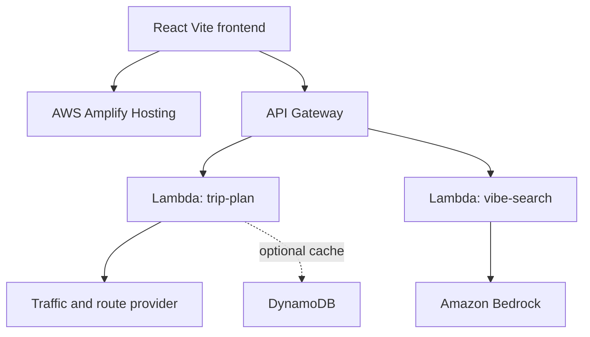

# Namma Flow Architecture

## Current MVP

The browser application lives in `frontend/` and uses React, Vite, and Tailwind CSS. `frontend/src/data/` contains simulated zones, routes, and vibe suggestions. `frontend/src/utils/helpers.js` owns deterministic matching, time-of-day, congestion, departure, duration, and sorting rules.

React pages call `frontend/src/services/tripService.js` and `vibeService.js`. Those services default to local data and can switch to HTTP through `VITE_API_BASE_URL`; components do not own fetch calls or backend credentials.

The map surface is isolated behind `frontend/src/components/maps/GridMap.jsx` and `CompassMap.jsx`, so the frontend owners can refine Leaflet behavior without coupling map code to business rules.

## Planned AWS path

`backend/lambdas/` contains API Gateway-compatible handlers with CORS, input validation, JSON responses, and deterministic demo services. They are not deployed by this repository yet. `backend/services/bedrockService.js` intentionally uses local classification and documents the future Bedrock boundary.

## Environment and security

Only safe public configuration belongs in the root `.env.example`; copy it to `frontend/.env.local` for Vite. It currently documents `VITE_API_BASE_URL` and `VITE_USE_MOCK_API`. AWS access keys, Bedrock credentials, and private API keys must stay in IAM roles, local AWS profiles, or deployed secret configuration, never in `VITE_*` variables.

## Collaboration boundaries

Data/helpers and AWS preparation remain separate from the Grid UI, Grid integration, and Compass workstreams. See `docs/TEAM_CONTRACTS.md` for ownership and contracts.
